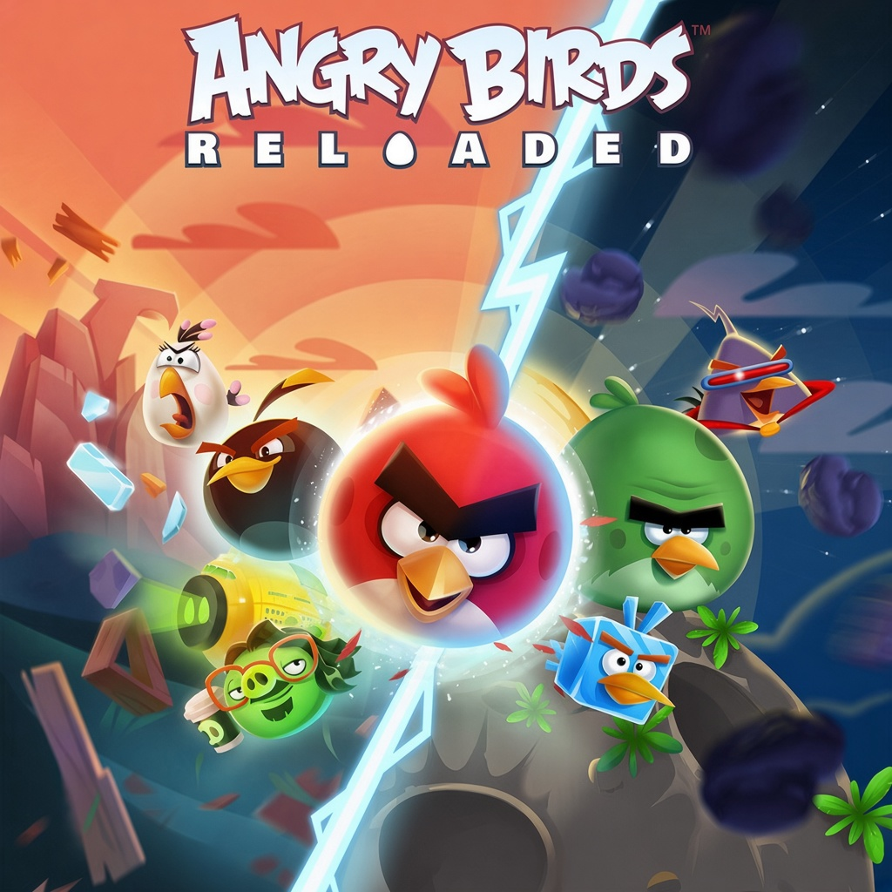

<div align="center">



# abreloaded_nx

**Angry Birds Reloaded 2.2.16218 on Nintendo Switch**

An unofficial Nintendo Switch wrapper for the Android version of
**Angry Birds Reloaded**.

[](#)
[](#)
[](#)

</div>

---

## About

`abreloaded_nx` is a native wrapper that runs the ARM64 Android build of
**Angry Birds Reloaded** on Nintendo Switch. It recreates the Android and JNI
services expected by the game under Horizon OS.

This release targets **Angry Birds Reloaded 2.2.16218**, built with
**Unity 2022.3.7f1**, IL2CPP and ARM64.

The repository does not include the game, APK, libraries or assets. You must
provide your own legally obtained copy.

---

## Controls

| Input | Action |
| --- | --- |
| **Touchscreen** | Native touch controls |
| **Left Stick** | Move the cursor |
| **A / ZL / ZR** | Tap or drag |
| **B** | Back |
| **L / R** | Recenter the cursor |
| **+** | Show or hide the cursor |
| **–** | Enable or disable gyro aiming |
| **D-Pad Up / Down** | Adjust cursor sensitivity |

A USB mouse can also move the cursor and click. Cursor settings are saved in
`pointer.cfg`.

---

## Build

### Requirements

* devkitPro
* devkitA64 and libnx
* Switch Mesa and libdrm_nouveau
* Switch SDL2, zlib and libpng
* GNU Make

Install the required devkitPro packages:

```bash
pacman -S switch-dev switch-mesa switch-libdrm_nouveau switch-sdl2 switch-zlib switch-libpng
```

Compile the wrapper:

```bash
cd abreloaded_nx
make -j
```

For a clean rebuild:

```bash
make clean
make -j
```

---

## Running

Extract the Android game files from your own APK and create this folder on the
SD card:

```text
sd:/switch/abreloaded/
├── abreloaded_nx.nro
├── libmain.so
├── libunity.so
├── libil2cpp.so
├── cursor_pointer.png
├── cursor_grab.png
└── assets/
```

The three libraries are found in `lib/arm64-v8a/` inside the APK. Copy the
complete `assets/` directory without changing its layout.

Launch the NRO through title override for full application memory: hold **R**
while opening an installed game, then start `abreloaded_nx` from the Homebrew
Menu.

---

## Status

Gameplay, assets, audio, cutscenes, touchscreen input and controller cursor
input are working. Startup and scene transitions can still take longer than on
the original platforms.

The wrapper is built specifically for game version **2.2.16218**. Libraries
from another release may require different patches and are not supported.

---

## Credits

**Angry Birds Reloaded Nintendo Switch port** — aks796

**Fruit Ninja Classic+ Nintendo Switch port and base wrapper** — ChanseyIsTheBest

The loader and compatibility layer derive from the open-source Switch `.so`
loader work by Andy Nguyen, fgsfds and ChanseyIsTheBest, building on
TheOfficialFloW's Vita and Switch loader work. This project also draws from the
Zookeeper DX, PvZ Fusion and Animal Crossing: Pocket Camp ports. The inherited
wrapper code is MIT-licensed.

**Angry Birds Reloaded** was developed and published by Rovio Entertainment.

---

## Contributing

Bug reports and tested improvements are welcome. Include the build version,
steps to reproduce and the relevant `debug.log` when reporting an issue.

---

## Disclaimer

This is an unofficial fan project and is not affiliated with, sponsored by or
endorsed by Rovio Entertainment. Angry Birds Reloaded and all related artwork,
audio, trademarks and game assets belong to their respective owners.

This repository contains only the compatibility code required by the Nintendo
Switch port and does not distribute proprietary game files.
